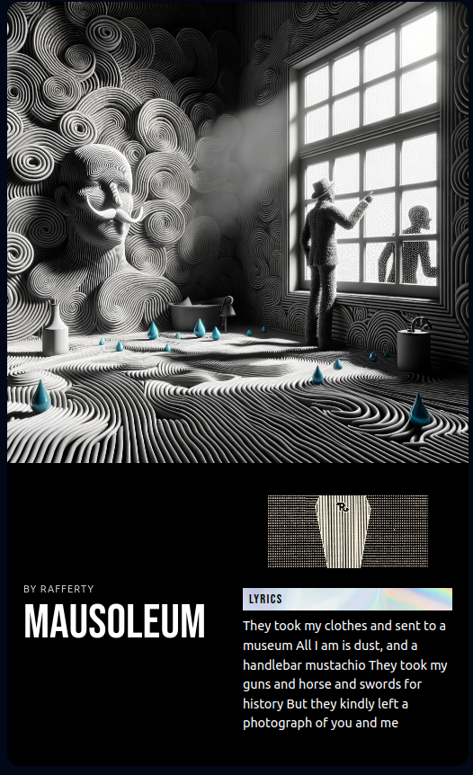
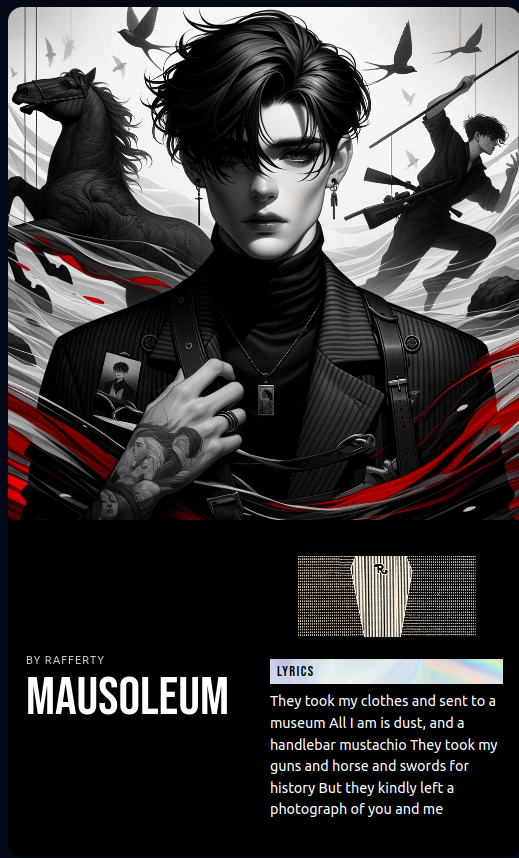
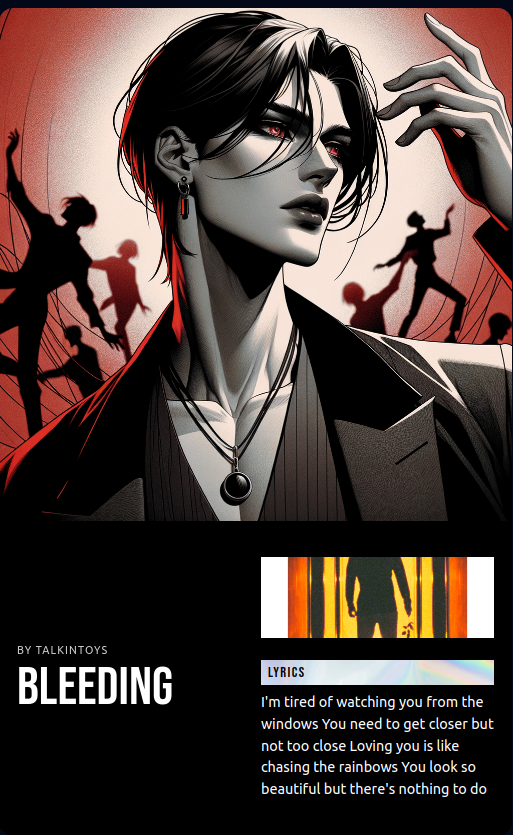
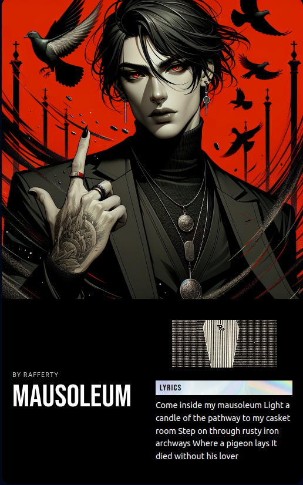
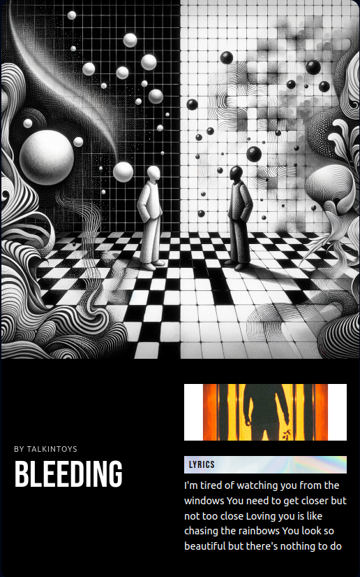

<h1 align="center">VibeVerse AI</h1>
<h4 align="center">Using DALL-E and Spotify API to Create Lyrics Posters That Personify the Song's Vibe</h4>

<div>
    <a href="https://www.loom.com/share/73571f59319c4a88a550155c076ba80d">
      
    </a>
  </div>
  
## How To Use

```bash
# Clone this repository
$ git clone https://github.com/everkers/vibeverse-ai

# Go into the repository
$ cd vibeverse-ai

# Install dependencies
$ npm install

# Add your env variables
$ cp env.example .env

# Run the app
$ npm start
```

## Images Generated

<p float="left">
  
  
  
  
  
</p>
